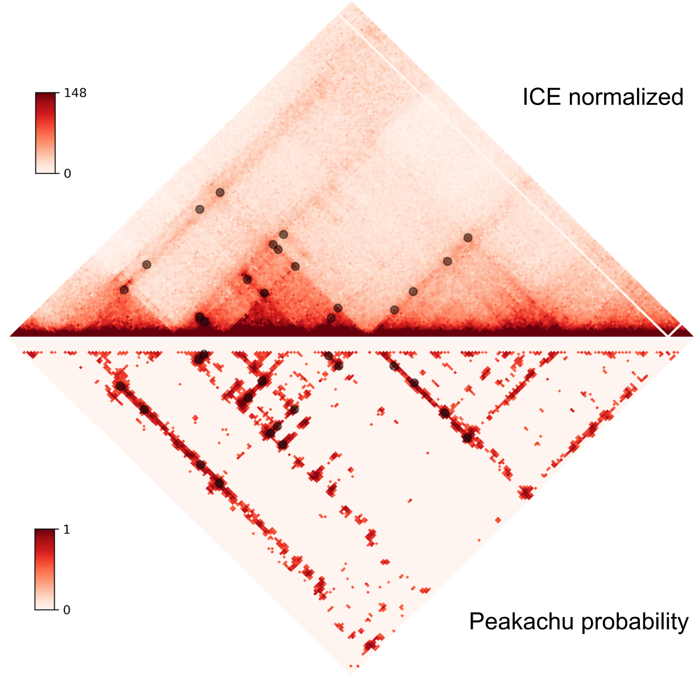
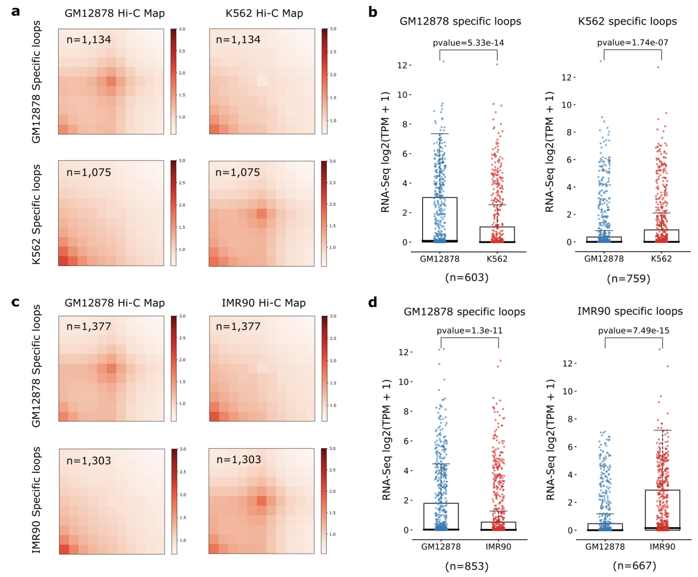

Introduction
============
As shown in the figure below, Peakachu scoring (by ``peakachu score_genome`` or ``peakachu score_chromosome``)
can be viewed as a complex normalization procedure taking both genomic distance and
local background of each contact into account.

We found the fold change of the Peakachu probability scores can be directly used to
identify differential chromatin loops between samples. To demonstrate this, we proposed
a pipeline and identified cell-type specific loops between GM12878 and K562, and also
between GM12878 and IMR90. We found the differential chromatin loops are associated with
dynamic gene expressions. (Supplementary Figure 20 of the manuscript).

Pipeline
========
This tutorial will reproduce the supplementary figure 20a.

First, download contact matrices in `.cool <https://mirnylab.github.io/cooler/>`_ format from 4DN::

    wget -O GM12878-MboI-allReps-filtered.mcool https://data.4dnucleome.org/files-processed/4DNFIXP4QG5B/@@download/4DNFIXP4QG5B.mcool
    wget -O K562-MboI-allReps-filtered.mcool https://data.4dnucleome.org/files-processed/4DNFI18UHVRO/@@download/4DNFI18UHVRO.mcool

Then download the pre-trained models and run ``peakachu`` as described in the `main page <https://github.com/tariks/peakachu>`_::

    wget -O down100.ctcf.pkl https://dl.dropboxusercontent.com/s/enyg2m7ebj8mxsv/down100.ctcf.pkl?dl=0
    wget -O down100.h3k27ac.pkl https://dl.dropboxusercontent.com/s/yasl5hu0v510k2v/down100.h3k27ac.pkl?dl=0
    wget -O down30.ctcf.pkl https://dl.dropboxusercontent.com/s/f1383jpzj3addi4/down30.ctcf.pkl?dl=0
    wget -O down30.h3k27ac.pkl https://dl.dropboxusercontent.com/s/dyvtyqvu3wpq3a5/down30.h3k27ac.pkl?dl=0
    # peakachu scoring for GM
    peakachu score_genome -r 10000 --balance -m down100.ctcf.pkl -p GM12878-MboI-allReps-filtered.mcool::resolutions/10000 -O GM12878-CTCF --minimum-prob 0
    peakachu score_genome -r 10000 --balance -m down100.h3k27ac.pkl -p GM12878-MboI-allReps-filtered.mcool::resolutions/10000 -O GM12878-H3K27ac --minimum-prob 0
    # peakachu scoring for K562
    peakachu score_genome -r 10000 --balance -m down30.ctcf.pkl -p K562-MboI-allReps-filtered.mcool::resolutions/10000 -O K562-CTCF --minimum-prob 0
    peakachu score_genome -r 10000 --balance -m down30.h3k27ac.pkl -p K562-MboI-allReps-filtered.mcool::resolutions/10000 -O K562-H3K27ac --minimum-prob 0
    # call loops for GM
    for i in GM12878-CTCF/*bed; do peakachu pool -i $i -t .98 > ${i}.loops; done
    cat GM12878-CTCF/*bed.loops > GM12878-CTCF.0.98.loops
    for i in GM12878-H3K27ac/*bed; do peakachu pool -i $i -t .91 > ${i}.loops; done
    cat GM12878-H3K27ac/*bed.loops > GM12878-H3K27ac.0.91.loops
    bedtools pairtopair -is -slop 25000 -type notboth -a GM12878-H3K27ac.0.91.loops -b GM12878-CTCF.0.98.loops > tmp
    cat GM12878-CTCF.0.98.loops tmp > GM12878.merged.loops
    # call loops for K562
    for i in K562-CTCF/*bed; do peakachu pool -i $i -t .96 > ${i}.loops; done
    cat K562-CTCF/*bed.loops > K562-CTCF.0.96.loops
    for i in K562-H3K27ac/*bed; do peakachu pool -i $i -t .88 > ${i}.loops; done
    cat K562-H3K27ac/*bed.loops > K562-H3K27ac.0.88.loops
    bedtools pairtopair -is -slop 25000 -type notboth -a K562-H3K27ac.0.88.loops -b K562-CTCF.0.96.loops > tmp
    cat K562-CTCF.0.96.loops tmp > K562.merged.loops

Note that to get better estimation of fold change, we should output probability scores for all
pixels (``--minimum-prob 0``).

Then run the ``pair-probs.py`` script to load and pair probability scores for the union of GM12878 and
K562 loops::

    python pair-probs.py GM12878.merged.loops K562.merged.loops GM12878-K562.merged.loops

Finally, the ``diffPeakachu.py`` script will quantile normalize scores, calculate the fold change and apply a
Gaussian Mixture Model based procedure to determine the threshold for differential loops::

    python diffPeakachu.py GM12878.merged.loops K562.merged.loops GM12878-K562.merged.loops

You can find the GM12878 specific and K562 specific loops in "GM12878-K562.GM12878.unique.loops" and
"GM12878-K562.K562.unique.loops", respectively::

    $ wc -l GM12878-K562.GM12878.unique.loops
    1134 GM12878-K562.GM12878.unique.loops
    $ wc -l GM12878-K562.K562.unique.loops
    1075 GM12878-K562.K562.unique.loops

You can further generate APA (Aggregation Peak Analysis) plots using the ``apa-analysis`` script from
`HiCPeaks <https://github.com/XiaoTaoWang/HiCPeaks/>`_.

